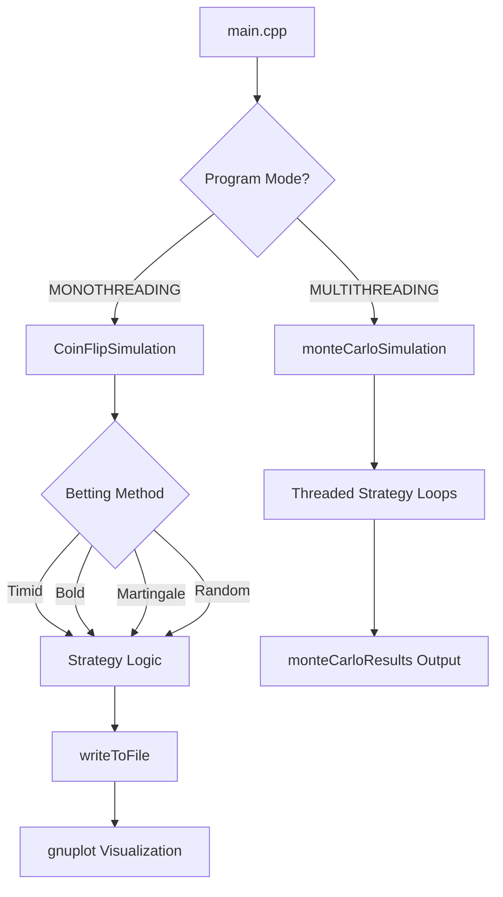

# <p align="center">Coin-Flip-Betting-Simulation <p>

<p align="center">

<p>

I implemented a simple coin flip betting simulator engine in C++23 

>[!CAUTION]
>This version is incomplete and unsafe (memory safety, numerical accuracy, thread safety), don't rely on any of it's parts for anything you make

# How to run it 

Step 1 : Make a file called `CoinFlipSimulator`
Step 2 : Inside this file put all the `.h` files and the `.cpp` file
Step 3 : Inside the `CoinFlipSimulator` put the `CMakeLists.txt` file provided 

>[!Important]
>The `CMakeLists.txt` needs to be inside `CoinFlipSimulator`

Step 4 : Install GCC (Well good luck with that) [Tutorial on installing GCC](https://phoenixnap.com/kb/install-gcc-windows)
Step 5 : Install Gnuplot [Tutorial on installing Gnuplot](https://riptutorial.com/gnuplot/example/11275/installation-or-setup)

If installation was succesful in a powershell this should be what you see


Step 6 : On a powershell terminal execute these commands **one at a time**

For Windows :

```

cd "The files path ex C:\Users\John\Desktop\CoinFlipSimulator"
Get-Content CMakeLists.txt //Verify that the CMakeLists.txt file you see is the same as the one you downloaded
(Optional , **run after the first time running the program** ) Remove-Item -Recurse -Force build //Delets any previous build 
cmake -B build -G "MinGW Makefiles" -DCMAKE_CXX_COMPILER=g++ //Force our compliler to be GCC
cmake --build build
build\GarndpasPensionDemolisherStrategies.exe

```
>[!Tip]
>After this you can re-use the last command after making changes to the program to run it without rebuilding it!

>[!Tip]
>In monothreading mode sometimes the bold strategy wins or loses in 1 round , dont be scared by the gnuplot warnings and the empty diagram
>,it just means that it doesnt have more that one data point to plot on the diagram!

For Linux (**Not tested**) :

```

cd CoinFlipSimulator
cmake -B build
cmake --build build
./build/GarndpasPensionDemolisherStrategies

```

## What this program does

`For anyone wondering , no , this program won't help you become a millionaire by backtesting your favorite coin flip gambling strategy`

In it's core the program is fairly simple and has two modes 

1) Mode 1 : Monothreading
2) Mode 2 : Multithreading (` Take that GIL `)

### How to switch between modes 

First navigate to the `ProgramMode.h` header file and uncomment the mode you want the program to execute in 

Example : The program will execute in a single thread

```
#define MONOTHREADING
//#define MULTITHREADING
```
Example : The program will execute on 16 threads 

```
//#define MONOTHREADING
#define MULTITHREADING
```

>[!WARNING]
>Only one mode should be used at a time , otherwise UB takes place 

### Monothreading mode 

In this mode the program executes on a single logical processor (thread) simulating a single strategy at a time untill it finishes 

### Multithreading mode 

In this mode the program simulates all strategies N-th times parrallel to each other and returns the total success rate for each one (more on this later)

## Betting strategies 

In the file `BettingStrats` i have implemented 4 betting strategies the user of this program can simulate 

1) Timid : The timid strategy bets the same fixed amount each round regardless of outcome untill either it achieves it's goal or bankrupts the player
2) Bold : The bold strategy bets all of the balance if the players balance is less that half of the goal and bets the amount needed to hit the goal if the balance exceeds half of the goal
3) Martingale : This strat relies on the very simple technique of doubling the bet after every loss hoping for a big win . I implemented it with a twist . If the player is in a consecutive loss spree and has to double his/her bet but this isn't possible due to missing funds the program goes all in either letting them continue to playing or bankrupting in a single bet
4) RandomBets : This is the one strat that i had the most fun implementing . The idea behind it is very simple . The gambler has one too many shots of tequila (or something stronger) before starting to play . So now the only thing he remembers is how much he has to win . Every round he bets random amounts . Thankfully for us one of his friends is there reminding him of the possible bets he can make , so he doesn't  bet more than he has or leaves before he hits his goal . Thank you friend !

## The `RandomGen.h` file 

In the core of this program lies a simple function template . Navigating to the `RandomGen.h` header file we see at the bottom :

```
template < typename T > 
inline T getReal(T min , T max)
{
    return std::uniform_real_distribution<T>{ min , max }(mt) ;
}
```

This inline function template is vital for the execution of our simulations

->inline allows multiple identical definitions across translation units without violating the One Definition Rule.

-> Using the template we can input arguments of the same floating data type (only tested for floating fundamental data types [C++ Fundamental Data Types(https://en.cppreference.com/cpp/language/types)) in a logical order and receive a pseudorandom random 64 bit number inbetween those two parameters we gave the `getReal()` function (in  [a , b)) . We use the pseudo random number generator mersenne twister 
[C++ Mersenne Twister](https://en.cppreference.com/cpp/numeric/random/mersenne_twister_engine)
and we seed it once when `getReal()` is first called with a std::random_device type number form the OS [Pseudorandom Numbers Coming From The OS](https://en.cppreference.com/cpp/numeric/random/random_device) . Cpp reference gives a very good example on that exact thing .

->The return type matches the function parameters and by using `return std::uniform_real_distribution<T>` we ensure that each number appears with the same frequency . Although in the specific program we will never see a repeating number for 0 - 2^19937 - 1 repetions [Mersenne Twister 64 bit Range -  Characteristics Section](https://en.wikipedia.org/wiki/Mersenne_Twister)

### Examples

In main we can call 

```
std::cout << getReal( 1.0 , 10.0 ) ; // Each number must be of floating data type
```

And we receive : `9.56512` which is valid

If we try to call

```
std::cout << getReal( 1 , 10 ) ;
```
We get 

```
ERROR!
In file included from /usr/local/include/c++/14.2.0/random:48,
                 from /tmp/V71X4w0gMq/main.cpp:1:
/usr/local/include/c++/14.2.0/bits/random.h: In instantiation of 'class std::uniform_real_distribution<int>':
/tmp/V71X4w0gMq/main.cpp:20:58:   required from 'T rnd::getReal(T, T) [with T = int]'
   20 |     return std::uniform_real_distribution<T>{ min , max }(mt) ;
      |            ~~~~~~~~~~~~~~~~~~~~~~~~~~~~~~~~~~~~~~~~~~~~~~^~~~
/tmp/V71X4w0gMq/main.cpp:28:30:   required from here
   28 |     std::cout << rnd::getReal( 1 , 10 ) ;
      |                  ~~~~~~~~~~~~^~~~~~~~~~
/usr/local/include/c++/14.2.0/bits/random.h:1883:56: error: static assertion failed: result_type must be a floating point type
 1883 |       static_assert(std::is_floating_point<_RealType>::value,
      |                                                        ^~~~~
/usr/local/include/c++/14.2.0/bits/random.h:1883:56: note: 'std::integral_constant<bool, false>::value' evaluates to false

```
Because regardless that our function can accept both integral values `std::uniform_real_distribution<T>` only accepts floating data types as valid template parameters 

A simple fix is changing it to `std::uniform_int_distribution<T>` but then the function will accept only integral type parameters 

# How to run YOUR simulations using this program (MONOTHREADING ONLY)

## Step 1 : Configurating each players data 

To set each strategies simulation parameters we move to the `CasesInfo.h` header file .

There we can see 4 class objects :

```
inline GamblerInfo TimidStrategyPlayer { 50 , 0.5 , 1 , 150 } ; // Timid strategy
inline GamblerInfo BoldStrategyPlayer { 50 , 0.5 , 1 , 150 } ; //Bold strategy 
inline GamblerInfo MartinGaleStrategyPlayer { 50 , 0.5 , 1 , 150 } ; // Martingale strategy
inline GamblerInfo ForgetfulStrategyPlayer { 50 , 0.5 , 1 , 150 } ; // Random betting strategy
```

Each is corresponding to a specific strategy as depicted by the respecting comments

To change each simulation's parameters we change the values of the objects above according to this template 

```
StrategyNamePlayer { StartingBalance , PropabilityOfWinningTheCoinFlip , InitialBet , Goal }
```

All parameters are of type `double` so they should not exceed values outside the range of  2.22507e-308 to 1.79769e+308

### Example 

Lets initialize a martingale strategy player which starts with :

1) 100 $ 
2) Has an edge against the house P = 0.51
3) Bets start at 25 $
4) Wants to 10x his initial capital so 1000$ goal

`inline GamblerInfo MartingaleStrategyPlayer { 100 , 0.51 , 25 , 1000 } ; `

>[!Warning]
>Do not initialize a new class object just change the existing values from the simualtion object you want to initiate found in the `CasesInfo.h` header file

## Step 2 : Calling your desired betting strategy simulation

In main :

```
std::cout <<  CoinFlipSimulation( StrategyNamePlayer , NameOStrategy , data -> This should always be data) ;
```
Example 

```
std::cout << CoinFlipSimulation( ForgetfulStrategyPlayer , random , data ) ;

```

And that is it !

>[!Important]
>For now StrategyNamePlayer can only be : TimidStrategyPlayer , BoldStrategyPlayer , MartingaleStrategyPlayer  and  ForgetfulStrategyPlayer and NameOfStrategy can only be :
>timid ,bold , martingale and random

# Multithreading Simulations

In Multithreading sadly the only change that can be made is the number of simulations for all strategies by using the `monteCarloSimualtion()` function to execute the simulation and the `monteCarloResults()` function to print the results to the user

In main :

```
monteCarloSimulation( NumberOfSimualations );
monteCarloResults() ; // To get the results
```

Example 

```
monteCarloSimulation( 1000 ); // 1000 calls to each simulation function
monteCarloResults() ;
```
when 
```
inline GamblerInfo TimidStrategyPlayer { 50 , 0.5 , 1 , 150 } ;
inline GamblerInfo BoldStrategyPlayer { 50 , 0.5 , 1 , 150 } ;
inline GamblerInfo MartinGaleStrategyPlayer { 50 , 0.5 , 1 , 150 } ;
inline GamblerInfo ForgetfulStrategyPlayer { 50 , 0.5 , 1 , 150 } ;
```

Which returns 

```
Timid strategy with a win rate of 24.0952
Bold strategy with a win rate of 38.7003
Martingale strategy with a win rate of 31.2709
Random strategy with a win rate of 23.1025
```

# The CoinFlipSimulation function

The function `CoinFlipSimulation()` is responsible for initializing the the monothreading simulation process 

We can pass 3 arguments :
1) The player's info
2) The betting method we want to simulate
3) The struct we want to return to receive the results of our simulation

On the more technical side : `inline SimulationStatististics& CoinFlipSimulation( GamblerInfo& Player , BettingMethod method , SimulationStatististics& stats)` this is our simulator in it's true form 

We pass two class objects by reference to avoid expensive copies and an enumerator from an enum class ( located in the `Enum.h` header file ) to select another function to be called by our function to initialize the simulation!

`python devs in sambles right now (joke!!!) ` 

 In reality what happens is :


    
### The functions `writeToFile()` , `plot()` and the convencience of using gnuplot

In their respecting files `FileHandler.h` and `Plotting.h` we can find (excluding the error handling functions) two new functions which are operating in the background bu
give us huge side effects 

writeToFile : in `FileHandler` we find this 

```
inline void writeToFile( const std::vector<double>& balanceValues , const std::string& fileName ) //std::ofstream can't be const( we write to it)
{
    std::ofstream objectFileName ;

    objectFileName.open(fileName) ; //Open the provided object file with the chose name

    if(isFileOpen(objectFileName))
    {
        for( int index = 0 ; index < std::ssize( balanceValues ) ; ++ index )
        {
            objectFileName << balanceValues[ index ] << '\n' ;
        }

        objectFileName.close() ;

    }
    else
        errorOpeningTheFile(fileName) ;
}
```

This function takes as input a `const std::vector` by reference and the name of a file . The function then using an object of type `std::ofstream`
[std::ofstream C++](https://en.cppreference.com/cpp/io/basic_ofstream) writes every change of balance in a .`txt` file with the name we specified . This function although primitive implements open file error checking routines using the `isFileOpen() bool return type` function which is irrelevant to our goal ( you can easily read it and understand its structure)

Throughout the execution of the different strategies we can find this line 

```
playerData.balanceValues.push_back(playerData.balance);
```

With that we are then able to pass this vector to our `writeToFile()` to save in the specified `.txt` file with the name we provided

plot : in `Plotting.h` we find this 

```
inline void plot(const std::string& fileName ,const std::string& plotTitle) // C-Style string concatenation (exceptional & this->C)
{
    std::string gnuplotCommand = "gnuplot -persistent -e \""
                                 "set object 1 rectangle from screen 0,0 to screen 1,1 fillcolor rgb 'black' behind;"
                                 " set border lc rgb 'white'; "
                                 "set xtics tc rgb 'white'; "
                                 "set ytics tc rgb 'white'; "
                                 "set key tc rgb 'white'; "
                                 "plot '"+fileName+"' with lines lc rgb 'red' title '"+plotTitle+"'\"";

    system(gnuplotCommand.c_str());
}
```

This is a very simple `inline` and `void` return type function which passes to the system a `gnuplot` command with that `.txt` file we need plotted and the title of the plot

`The usefulness of gnuplot can only be appreciated after trying to set up `ImPlot` for one of your projects`

Gnuplot is fed the data from the `.txt` file and produces a plot which stays on screen after the completion of the program.

# The Monte Carlo capabilities of the engine 

Inside the file `MonteCarloWalks.h` we find the function `monteCarloSimulation()` which takes as its only input a `std::uint64_t integer` to simulate to the desired number of iterations 

>[!Important}
>The number of iterations is not per strategy but affects all strategies simulateously

Example 

In main if we call

```
monteCarloSimulations(1000) ;
```

Every strategy we have implemented will run 1000 times ( 250 times in each thread in this specific case ) and return the results (if we use `monteCarloResults()`

## The body of `monteCarloSimulation()`

This function relies on the creation of 16 threads that each call a predifines lambda which call the respecting betting strategy function N times 

The lambdas are defines inside the `monteCarloSimulation()` body here : 

```
auto callTimid = []( std::uint64_t numberOfSimulations )
    {
        for( std::uint64_t index = 0 ; index < numberOfSimulations ; ++ index)
        {
            timidStrategy(TimidStrategyPlayer , data ) ;
            freeStruct( data ) ;
        }
    };
    auto callBold = []( std::uint64_t numberOfSimulations )
    {
        for( std::uint64_t index = 0 ; index < numberOfSimulations ; ++ index)
        {
            boldStrategy(BoldStrategyPlayer , data ) ;
            freeStruct( data ) ;
        }
    };
    auto callMartingale = []( std::uint64_t numberOfSimulations )
    {
        for( std::uint64_t index = 0 ; index < numberOfSimulations ; ++ index)
        {
            martingaleStrategy( MartinGaleStrategyPlayer , data ) ;
            freeStruct( data ) ;
        }
    };
    auto callRandom = []( std::uint64_t numberOfSimulations )
    {
        for( std::uint64_t index = 0 ; index < numberOfSimulations ; ++ index)
        {
            randomBetsStrategy(ForgetfulStrategyPlayer , data ) ;
            freeStruct( data ) ;
        }
    };
```

Lastly but extremely important is the use of `std::atomic` on the global variables that `monteCarloResults()`  uses to print out our results , although it looks unimportant it helps solve thread racing for the same variable to write to

>[!Tip]
>The `monteCarloResults()` function is pretty straightforward and easy to understand so i won't explain here how it works 

# The functions of our betting strategies 

Inside `BettingStrategies.h` exist our betting strategies functions , take a mental note of this location because it will become useful later 

# How to add YOUR OWN strategies (Experimental)
