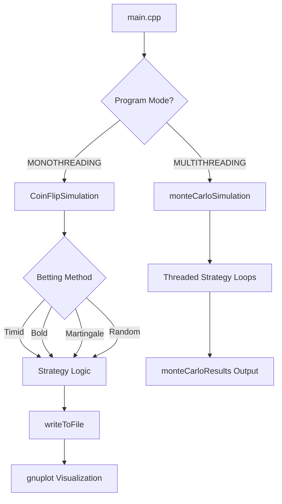

# <p align="center">Coin-Flip-Betting-Simulation <p>

<p align="center">

<p>

I implemented a simple coin flip betting simulator engine in C++23 

>[!CAUTION]
>This version is incomplete and unsafe (memory safety, numerical accuracy, thread safety), don't rely on any of its parts for anything you make

# How to run it 

Step 1 : Make a folder called `CoinFlipSimulator`

Step 2 : Inside this folder put all the `.h` files and the `.cpp` file

Step 3 : Inside `CoinFlipSimulator` put the `CMakeLists.txt` file provided

Step 4 : Install GCC (Well good luck with that) [Tutorial on installing GCC](https://phoenixnap.com/kb/install-gcc-windows)

Step 5 : Install Gnuplot [Tutorial on installing Gnuplot](https://riptutorial.com/gnuplot/example/11275/installation-or-setup)

Step 6 : Install CMake [Tutorial on installing CMake](https://medium.com/@WamiqRaza/how-to-install-and-run-cmake-on-windows-692258b07b6f)

If installation was successful, in a PowerShell terminal this should be what you see (CMake test for installation included in the tutorial provided)


Step 7 : On a PowerShell terminal execute these commands **one at a time**

For Windows :

```
cd "The file path e.g. C:\Users\John\Desktop\CoinFlipSimulator"
Get-Content CMakeLists.txt
cmake -B build -G "MinGW Makefiles" -DCMAKE_CXX_COMPILER=g++
cmake --build build
build\GarndpasPensionDemolisherStrategies.exe
```

>[!TIP]
>To rebuild after making changes to the program run `cmake --build build` followed by `build\GarndpasPensionDemolisherStrategies.exe`

>[!TIP]
>In monothreading mode, sometimes a strategy finishes in a single round. Don't be scared by the gnuplot warnings and the empty diagram — it just means there isn't more than one data point to plot

For Linux (**Not tested**, compiler flag may differ) :

```
cd CoinFlipSimulator
cmake -B build -DCMAKE_CXX_COMPILER=g++
cmake --build build
./build/GarndpasPensionDemolisherStrategies
```

## What this program does

`For anyone wondering, no, this program won't help you become a millionaire by backtesting your favorite coin flip gambling strategy`

At its core the program is fairly simple and has two modes 

1) Mode 1 : Monothreading
2) Mode 2 : Multithreading (` Take that GIL `)

### How to switch between modes 

First navigate to the `ProgramMode.h` header file and uncomment the mode you want the program to execute in 

Example : The program will execute in a single thread

```
#define MONOTHREADING
//#define MULTITHREADING
```
Example : The program will execute on 16 threads 

```
//#define MONOTHREADING
#define MULTITHREADING
```

>[!WARNING]
>Only one mode should be used at a time, otherwise undefined behavior takes place

### Monothreading mode 

In this mode the program executes on a single logical processor (thread) simulating a single strategy at a time until it finishes 

### Multithreading mode 

In this mode the program simulates all strategies N times in parallel and returns the total success rate for each one (more on this later)

## Betting strategies 

In the file `BettingStrategies.h` I have implemented 4 betting strategies the user of this program can simulate 

1) **Timid** : The timid strategy bets the same fixed amount each round regardless of outcome until either it achieves its goal or bankrupts the player
2) **Bold** : The bold strategy bets the entire balance if the player's balance is less than half of the goal, and bets the exact amount needed to hit the goal if the balance exceeds half of the goal
3) **Martingale** : This strategy relies on the simple technique of doubling the bet after every loss, hoping for a big win. I implemented it with a twist — if the player is on a consecutive loss streak and cannot double their bet due to insufficient funds, the program goes all in, either letting them continue playing or bankrupting them in a single bet
4) **RandomBets** : This is the one strategy I had the most fun implementing. The idea behind it is very simple. The gambler has one too many shots of tequila (or something stronger) before starting to play. So now the only thing they remember is how much they need to win. Every round they bet a random amount. Thankfully one of their friends is there reminding them of the possible bets they can make, so they don't bet more than they have or leave before hitting their goal. Thank you friend!

## The `RandomGen.h` file 

In the core of this program lies a simple function template. Navigating to the `RandomGen.h` header file we see at the bottom :

```cpp
template < typename T > 
inline T getReal(T min , T max)
{
    return std::uniform_real_distribution<T>{ min , max }(mt) ;
}
```

This inline function template is vital for the execution of our simulations

-> `inline` on a function template ensures that even if the definition appears in multiple translation units, the linker treats them as one — avoiding ODR violations when the header is included in multiple places.

-> Using the template we can input arguments of the same floating point data type (only tested for floating point fundamental data types [C++ Fundamental Data Types](https://en.cppreference.com/cpp/language/types)) in a logical order and receive a pseudorandom 64 bit number in the interval [a, b). We use the pseudorandom number generator Mersenne Twister [C++ Mersenne Twister](https://en.cppreference.com/cpp/numeric/random/mersenne_twister_engine), which is seeded once per thread when the `thread_local` variable `mt` is initialized using a `std::random_device` number from the OS [Pseudorandom Numbers Coming From The OS](https://en.cppreference.com/cpp/numeric/random/random_device). Cppreference gives a very good example on that exact thing.

-> The return type matches the function parameters and by using `return std::uniform_real_distribution<T>` we ensure that each number appears with the same frequency. In this program we will practically never see a repeating number as this PRNG has a period of 2^19937 - 1 [Mersenne Twister 64 bit Range - Characteristics Section](https://en.wikipedia.org/wiki/Mersenne_Twister)

### Examples

In main we can call 

```cpp
std::cout << getReal( 1.0 , 10.0 ) ; // Each argument must be of floating point data type
```

And we receive : `9.56512` which is valid

If we try to call

```cpp
std::cout << getReal( 1 , 10 ) ;
```
We get 

```
ERROR!
In file included from /usr/local/include/c++/14.2.0/random:48,
                 from /tmp/V71X4w0gMq/main.cpp:1:
/usr/local/include/c++/14.2.0/bits/random.h: In instantiation of 'class std::uniform_real_distribution<int>':
/tmp/V71X4w0gMq/main.cpp:20:58:   required from 'T rnd::getReal(T, T) [with T = int]'
   20 |     return std::uniform_real_distribution<T>{ min , max }(mt) ;
      |            ~~~~~~~~~~~~~~~~~~~~~~~~~~~~~~~~~~~~~~~~~~~~~~^~~~
/tmp/V71X4w0gMq/main.cpp:28:30:   required from here
   28 |     std::cout << rnd::getReal( 1 , 10 ) ;
      |                  ~~~~~~~~~~~~^~~~~~~~~~
/usr/local/include/c++/14.2.0/bits/random.h:1883:56: error: static assertion failed: result_type must be a floating point type
 1883 |       static_assert(std::is_floating_point<_RealType>::value,
      |                                                        ^~~~~
/usr/local/include/c++/14.2.0/bits/random.h:1883:56: note: 'std::integral_constant<bool, false>::value' evaluates to false
```

Because even though our function template can be instantiated with integral types, `std::uniform_real_distribution<T>` only accepts floating point types as valid template parameters.

A simple fix is changing it to `std::uniform_int_distribution<T>`, but then the function will only accept integral type parameters.

# How to run YOUR simulations using this program (MONOTHREADING ONLY)

## Step 1 : Configuring each player's data 

To set each strategy's simulation parameters we move to the `CasesInfo.h` header file.

There we can see 4 class objects :

```cpp
inline GamblerInfo TimidStrategyPlayer { 50 , 0.5 , 1 , 150 } ; // Timid strategy
inline GamblerInfo BoldStrategyPlayer { 50 , 0.5 , 1 , 150 } ; // Bold strategy 
inline GamblerInfo MartinGaleStrategyPlayer { 50 , 0.5 , 1 , 150 } ; // Martingale strategy
inline GamblerInfo ForgetfulStrategyPlayer { 50 , 0.5 , 1 , 150 } ; // Random betting strategy
```

Each corresponds to a specific strategy as shown by the respective comments.

To change each simulation's parameters we change the values of the objects above according to this template 

```
StrategyNamePlayer { StartingBalance , ProbabilityOfWinningTheCoinFlip , InitialBet , Goal }
```

All parameters are of type `double`.

### Example 

Let's initialize a martingale strategy player which starts with :

1) 100 $ 
2) Has an edge against the house P = 0.51
3) Bets start at 25 $
4) Wants to 10x their initial capital, so a 1000 $ goal

```cpp
inline GamblerInfo MartingaleStrategyPlayer { 100 , 0.51 , 25 , 1000 } ;
```

>[!WARNING]
>Do not initialize a new class object — just change the existing values of the simulation object you want to configure, found in the `CasesInfo.h` header file

## Step 2 : Calling your desired betting strategy simulation

In main :

```cpp
std::cout << CoinFlipSimulation( StrategyNamePlayer , NameOfStrategy , data ) ;
```

Example 

```cpp
std::cout << CoinFlipSimulation( ForgetfulStrategyPlayer , BettingMethod::random , data ) ;
```

And that is it !

>[!IMPORTANT]
>| Player Object | Strategy Enum |
>|---|---|
>| `TimidStrategyPlayer` | `BettingMethod::timid` |
>| `BoldStrategyPlayer` | `BettingMethod::bold` |
>| `MartinGaleStrategyPlayer` | `BettingMethod::martingale` |
>| `ForgetfulStrategyPlayer` | `BettingMethod::random` |

# Multithreading Simulations

In multithreading mode the only change that can be made is the number of simulations for all strategies, by using `monteCarloSimulation()` to execute and `monteCarloResults()` to print the results.

In main :

```cpp
monteCarloSimulation( NumberOfSimulations );
monteCarloResults() ;
```

Example 

```cpp
monteCarloSimulation( 1000 ); // 1000 calls to each strategy's simulation function
monteCarloResults() ;
```

When the player objects are configured as :

```cpp
inline GamblerInfo TimidStrategyPlayer { 50 , 0.5 , 1 , 150 } ;
inline GamblerInfo BoldStrategyPlayer { 50 , 0.5 , 1 , 150 } ;
inline GamblerInfo MartinGaleStrategyPlayer { 50 , 0.5 , 1 , 150 } ;
inline GamblerInfo ForgetfulStrategyPlayer { 50 , 0.5 , 1 , 150 } ;
```

This returns :

```
Timid strategy with a win rate of 24.0952
Bold strategy with a win rate of 38.7003
Martingale strategy with a win rate of 31.2709
Random strategy with a win rate of 23.1025
```

# The `CoinFlipSimulation` function

The function `CoinFlipSimulation()` is responsible for initializing the monothreading simulation process.

We can pass 3 arguments :
1) The player's info
2) The betting method we want to simulate
3) The struct that receives the results of our simulation

On the more technical side : `inline SimulationStatististics& CoinFlipSimulation( GamblerInfo& Player , BettingMethod method , SimulationStatististics& stats)` — this is our simulator in its true form.

We pass two objects by reference to avoid expensive copies and an enumerator from an enum class (located in `Enum.h`) to select which betting strategy function to call.

`Python devs in shambles right now (joke!!!) ` 

In reality what happens is :


    
### The functions `writeToFile()`, `plot()` and the convenience of using gnuplot

In their respective files `FileHandler.h` and `Plotting.h` we can find two functions (excluding error handling) which operate in the background but give us significant side effects.

**writeToFile** : in `FileHandler.h` we find this 

```cpp
inline void writeToFile( const std::vector<double>& balanceValues , const std::string& fileName )
{
    std::ofstream objectFileName ;

    objectFileName.open(fileName) ;

    if(isFileOpen(objectFileName))
    {
        for( int index = 0 ; index < std::ssize( balanceValues ) ; ++ index )
        {
            objectFileName << balanceValues[ index ] << '\n' ;
        }

        objectFileName.close() ;
    }
    else
        errorOpeningTheFile(fileName) ;
}
```

This function takes a `const std::vector` by reference and a file name. Using a `std::ofstream` object [std::ofstream C++](https://en.cppreference.com/cpp/io/basic_ofstream) it writes every balance change to a `.txt` file with the specified name. Throughout the execution of the different strategies we accumulate balance values with :

```cpp
playerData.balanceValues.push_back(playerData.balance);
```

Which we then pass to `writeToFile()` to save to disk.

**plot** : in `Plotting.h` we find this 

```cpp
inline void plot(const std::string& fileName , const std::string& plotTitle)
{
    std::string gnuplotCommand = "gnuplot -persistent -e \""
                                 "set object 1 rectangle from screen 0,0 to screen 1,1 fillcolor rgb 'black' behind;"
                                 " set border lc rgb 'white'; "
                                 "set xtics tc rgb 'white'; "
                                 "set ytics tc rgb 'white'; "
                                 "set key tc rgb 'white'; "
                                 "plot '"+fileName+"' with lines lc rgb 'red' title '"+plotTitle+"'\"";

    system(gnuplotCommand.c_str());
}
```

A simple `inline void` function that passes a gnuplot command to the system with the `.txt` file to plot and the title of the plot.

`The usefulness of gnuplot can only be appreciated after trying to set up ImPlot for one of your projects`

Gnuplot is fed the data from the `.txt` file and produces a plot which stays on screen after the program completes.

# The Monte Carlo capabilities of the engine 

Inside `MonteCarloWalks.h` we find the function `monteCarloSimulation()` which takes a single `std::uint64_t` argument representing the desired number of iterations.

>[!IMPORTANT]
>The number of iterations is not per strategy — it affects all strategies simultaneously

Example : if in main we call

```cpp
monteCarloSimulation(1000) ;
```

Every strategy will run 1000 times (250 times per thread in this specific case) and return the results via `monteCarloResults()`.

## The body of `monteCarloSimulation()`

This function creates 16 threads, each calling a predefined lambda which calls the respective betting strategy function N times.

The lambdas are defined inside the `monteCarloSimulation()` body :

```cpp
auto callTimid = []( std::uint64_t numberOfSimulations )
{
    for( std::uint64_t index = 0 ; index < numberOfSimulations ; ++ index)
    {
        timidStrategy(TimidStrategyPlayer , data ) ;
        freeStruct( data ) ;
    }
};
auto callBold = []( std::uint64_t numberOfSimulations )
{
    for( std::uint64_t index = 0 ; index < numberOfSimulations ; ++ index)
    {
        boldStrategy(BoldStrategyPlayer , data ) ;
        freeStruct( data ) ;
    }
};
auto callMartingale = []( std::uint64_t numberOfSimulations )
{
    for( std::uint64_t index = 0 ; index < numberOfSimulations ; ++ index)
    {
        martingaleStrategy( MartinGaleStrategyPlayer , data ) ;
        freeStruct( data ) ;
    }
};
auto callRandom = []( std::uint64_t numberOfSimulations )
{
    for( std::uint64_t index = 0 ; index < numberOfSimulations ; ++ index)
    {
        randomBetsStrategy(ForgetfulStrategyPlayer , data ) ;
        freeStruct( data ) ;
    }
};
```

Also extremely important is the use of `std::atomic` on the global variables that `monteCarloResults()` uses to print the results. Although it looks unimportant it prevents data races when multiple threads write to the same variable simultaneously.

>[!TIP]
>The `monteCarloResults()` function is straightforward and easy to read, so it won't be explained here.

# The betting strategy functions 

Inside `BettingStrategies.h` exist our betting strategy functions — take note of this location as it will become useful later.

# How to add YOUR OWN strategies (In construction)
